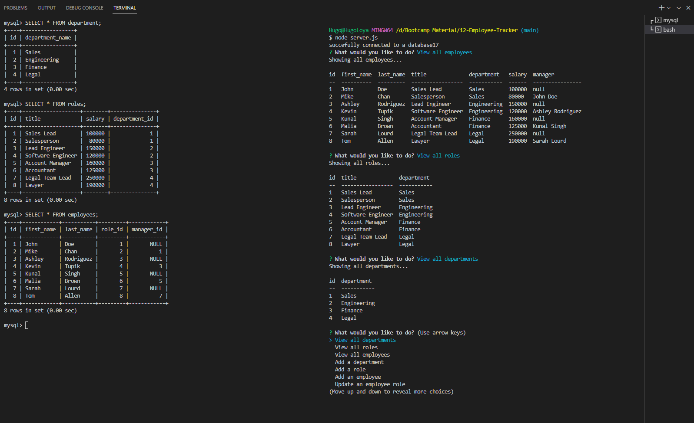

# Employee Tracker SQL

## Description

This is a command-line application built to help manage a company's employee database, using Node.js, Inquirer, and My SQL.

## Screenshots

 ## Technology Used
- Node.js
- Inquirer
- MySQL
- JavaScript

## Contact

- App GitHub Link - https://github.com/Hugooloya/12-Employee-Tracker

- Video Link - https://drive.google.com/file/d/16bsf72VcGNgavx00JJRFVMz-PgA0ILfe/view